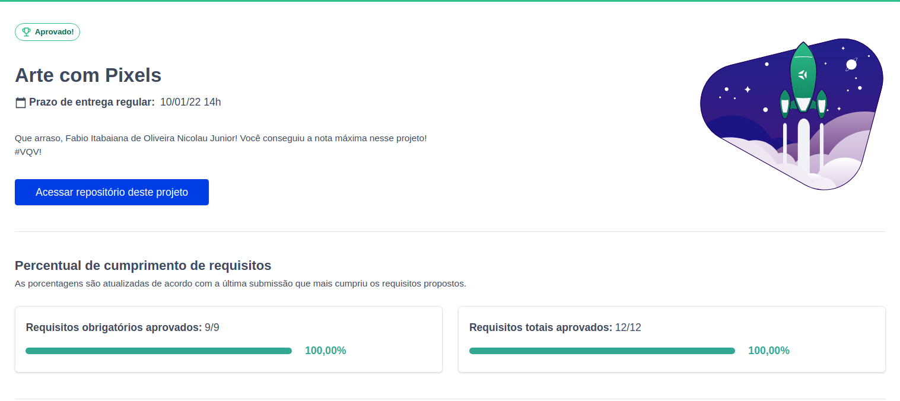

<h1>Sobre</h1>

Terceiro projeto do módulo 1 - Fundamentos, da <a href="https://betrybe.com" target="_blank">Trybe!</a>

O desafio foi construir uma aplicação em que era possível criar artes com pixels.

<a href="https://fabionicolau.github.io/pixels-art/" target="_blank">link da aplicação</a>

<h1>Tecnologias utilizadas</h1>
<ul>
  <li>HTML</li>
  <li>CSS</li>
  <li>JavaScript</li>
</ul>

<h1>Nota</h1>

